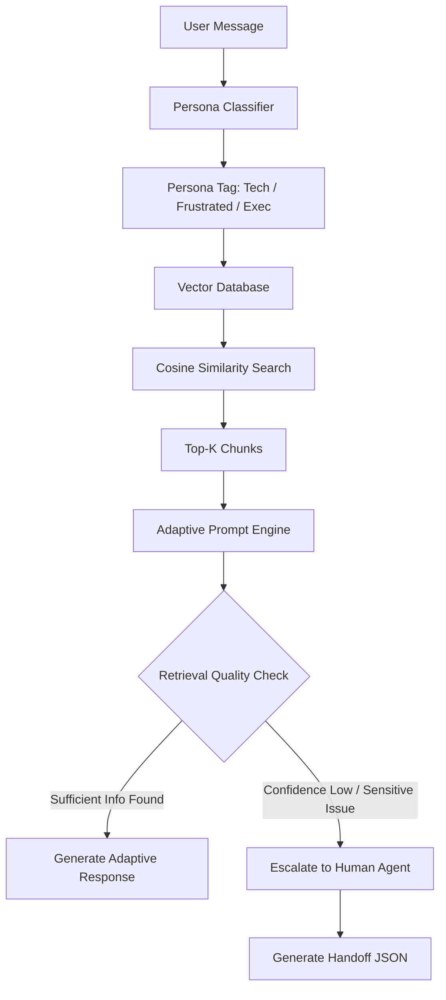

# Persona-Adaptive Customer Support Agent

A Streamlit demo that classifies a user message as `Tech`, `Frustrated`, or `Exec`, retrieves relevant support chunks from a local Chroma vector database, generates a persona-adapted response with Gemini, and escalates low-confidence or sensitive cases to a human handoff JSON.

## Architecture



## Project Structure

```text
persona-support-agent/
├── data/
│   ├── api_troubleshooting.md
│   ├── billing_policy.txt
│   └── password_reset_guide.pdf
├── src/
│   ├── __init__.py
│   ├── config.py
│   ├── classifier.py
│   ├── rag_pipeline.py
│   ├── generator.py
│   └── escalator.py
├── app.py
├── requirements.txt
├── .env.example
└── README.md
```

## Setup

Requires Python 3.11 or higher.

```powershell
python -m venv .venv
.\.venv\Scripts\Activate.ps1
pip install -r requirements.txt
```

Copy `.env.example` to `.env`, or keep using `API.env`, then add your Gemini key:

```text
GOOGLE_API_KEY=your-key-here
```

This project also reads `API.env` if you already keep credentials there.

## Run

```powershell
streamlit run app.py
```

Open the local Streamlit URL shown in the terminal.

## Notes

- Chroma stores the local index in `.chroma/`.
- The app uses Gemini embeddings and generation when `GOOGLE_API_KEY` or `GEMINI_API_KEY` is set.
- If no key is configured, it falls back to deterministic hash embeddings and a local extractive response so the workflow can still be inspected.
- Escalation is triggered for low retrieval confidence or sensitive billing, legal, account, and security language.

## Assignment Checklist

- Persona Classifier: implemented in `src/classifier.py` with `Tech`, `Frustrated`, and `Exec` labels.
- Vector Database: implemented with local Chroma persistence in `src/rag_pipeline.py`.
- Cosine Similarity Search: Chroma collection is configured with `hnsw:space = cosine`.
- Top-K Chunks: controlled by `top_k` in `src/config.py`.
- Adaptive Prompt Engine: implemented in `src/generator.py`.
- Retrieval Quality Check: implemented with configurable thresholds in `src/escalator.py`.
- Escalation to Human Agent: sensitive and low-confidence cases route to escalation.
- Handoff JSON: generated by `generate_handoff_json()` in `src/escalator.py`.
- PDF Support: `data/password_reset_guide.pdf` is read with `pypdf`.
- Streamlit UI: implemented in `app.py`.

Run the basic assignment check:

```powershell
.\.venv\Scripts\python.exe check_assignment.py
```
